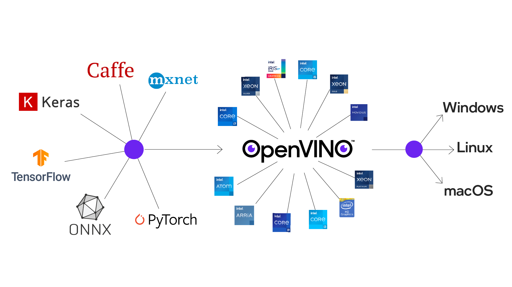
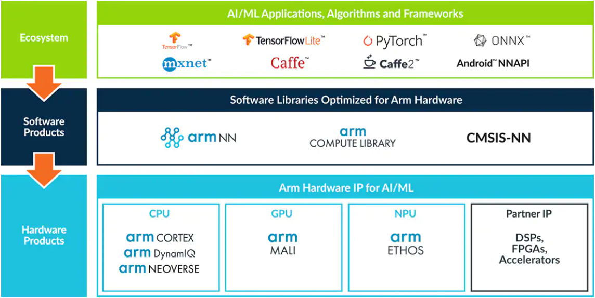

Typical Single Board Computer Ecosystems for Edge Computing
===========================================================

A Single Board Computer (SBC) is a computer where all the
components are placed on one Printed Circuit Board (PCB). This
report provides an overview of the relevant SBCs available on the market today and discusses the important hardware
components and available software tools. Since there are hundreds of
types of SBCs in existence for a very wide range of applications, it is
impossible to discuss all of them. Hence this report
relies on the major overarching ecosystems to define groups of
SBCs and will give
a general explanation of existing
edge computing ecosystems with SBCs and their specific
characteristics. Furthermore, the SBCs in the chosen ecosystems are,
whenever possible, compared based on hardware specifications and performance in benchmarks for specific Machine
Learning based computational tasks, where the starting point will be
existing standardized benchmarks.

Existing Ecosystems for SBC hardware
-----------------------------------------

NVIDIA
------

NVIDIA has developed a specific series of Single Board Computers, called
`Jetson <https://www.nvidia.com/en-us/autonomous-machines/jetson-store/>`_, for various AI-related
applications. This product family includes several generations of
CPU and GPU products with some key differences towards
computing capabilities. The main added value in the context
of Edge-AI of the Jetson series is the on-board hardware for
acceleration of ML-related calculations, so that these devices have a
performance for AI inference and at the same time minimize the
necessary power consumption. An important
hardware component when choosing a Jetson SBC is the on-board
Graphical Processing Unit (GPU). The first generation Jetson uses
the Maxwell GPU architecture,
followed by the Pascal architecture.
The latest generation of Jetsons uses the Volta
architecture where an important addition are the
Tensor Cores, these cores provide
significant performance gains in inference because of the
ability to do mixed precision floating point calculations
to optimize ML models very flexible. Furthermore, it is true that
NVIDIA not only provides hardware solutions but also an extensive set of software libraries
to make the best use of the hardware accelerators present on
the SBCs. Important
software in this ecosystem is the Jetpack
SDK which includes a linux operating system
for the Jetson SBCs and further bundles all other important libraries.
For example, there is the CUDA computing toolkit to provide GPU computing,
cuDNN the CUDA deep learning accelerator framework and Tensor
RT which is a framework to handle ML tasks such as
image classification, object detection, image segmentation, minimize latency and accelerate inference.
Furthermore, there is the image processing framework
Visionworks which can optimize a large number of
image processing tasks. In addition to the Jetpack SDK, they
recently added the NVIDIA Transfer Learning
toolkit. This software serves
specifically to make pre-trained ML models for a range of use cases available for
direct use in AI applications. The
models are optimized for inference on NVIDIA hardware and
aim to minimize the time to market since one does not have to start from
scratch. The available models can also be adapted
(transfer learning) to specific use cases.
The Jetson SBCs available today are the Jetson Nano,
Jetson TX2, Jetson Xavier NX and the Jetson AGX Xavier. The main
differences between these SBCs are listed below.

-  | **Jetson Nano**
   | The Jetson Nano is NVIDIA's first generation SBC and features
     a Quad Core ARM A57 CPU and a 128-core Maxwell GPU and has
     an AI performance of 472 GFLOPs.

   .. container::
      :name: tab:jetsonnano

      .. table:: Specifications of Jetson Nano

         ========================= ==============================================
         **Jetson Nano SBC**       
         ========================= ==============================================
         AI performance            472 GFLOPs
         CPU                       Quad Core ARM A57 CPU
         GPU                       128-core Maxwell GPU
         Memory                    4 GB 64-bit LPDDR4 25.6GB/s
         Storage                   SD-card when dev kit otherwise eMMC 5.1
         CSI Camera                4 cameras D-PHY 1.1 (18 Gbps)
         Power                     5W - 10W
         Deep Learning Accelerator None
         Vision Accelerator        None
         ========================= ==============================================

-  | **Jetson TX2**
   | The Jetson TX2 is the successor to the Jetson Nano and is available
     in several versions. This SBC has significantly more
     computational power and also features a newer GPU
     architecture (Pascal) with 256 GPU cores.

   .. container::
      :name: tab:jetsontx2

      .. table:: Specifications of the Jetson TX2.

         +---------------------------+-----------------------------------------+
         | **Jetson TX2**            |                                         |
         +===========================+=========================================+
         | AI performance            | 1.33 TFLOPs                             |
         +---------------------------+-----------------------------------------+
         | CPU                       | Dual-Core NVIDIA Denver 2 64-Bit CPU +  |
         |                           | Quad Core ARM A57 CPU                   |
         +---------------------------+-----------------------------------------+
         | GPU                       | 256-core NVIDIA Pascal GPU              |
         +---------------------------+-----------------------------------------+
         | Memory                    | 8 GB 128-bit LPDDR4 59.7 GB/s           |
         +---------------------------+-----------------------------------------+
         | Storage                   | 32GB eMMC 5.1                           |
         +---------------------------+-----------------------------------------+
         | CSI Camera                | 6 cameras D-PHY 1.2 (30 Gbps)           |
         +---------------------------+-----------------------------------------+
         | Power                     | 7.5W - 15W                              |
         +---------------------------+-----------------------------------------+
         | Deep Learning Accelerator | None                                    |
         +---------------------------+-----------------------------------------+
         | Vision Accelerator        | None                                    |
         +---------------------------+-----------------------------------------+

-  | **Jetson Xavier NX**
   | The Jetson Xavier NX is the first SBC of the newer Xavier family
     and features massively more computational power in
     comparison to the Jetson Nano and TX2. Furthermore, this SBC includes a
     GPU with the newer Volta architecture with 384 GPU cores and also 48
     of the advanced Tensor Cores.

   .. container::
      :name: tab:jetsonnx

      .. table:: Specifications of the Jetson Xavier NX.

         +---------------------------+-----------------------------------------+
         | **Jetson Xavier NX**      |                                         |
         +===========================+=========================================+
         | AI performance            | 21 TFLOPs (INT8)                        |
         +---------------------------+-----------------------------------------+
         | CPU                       | 6-core NVIDIA Carmel Arm v8.2 64-bit    |
         |                           | CPU                                     |
         +---------------------------+-----------------------------------------+
         | GPU                       | 384-core NVIDIA Volta GPU + 48 Tensor   |
         |                           | Cores                                   |
         +---------------------------+-----------------------------------------+
         | Memory                    | 8 GB 128-bit LPDDR4x 51.2GB/s           |
         +---------------------------+-----------------------------------------+
         | Storage                   | SD-card when developer kit otherwise    |
         |                           | 16 GB eMMC 5.1                          |
         +---------------------------+-----------------------------------------+
         | CSI Camera                | 6 cameras D-PHY 1.2 (30 Gbps)           |
         +---------------------------+-----------------------------------------+
         | Power                     | 10W - 15W                               |
         +---------------------------+-----------------------------------------+
         | Deep Learning Accelerator | 2x NVDLA                                |
         +---------------------------+-----------------------------------------+
         | Vision Accelerator        | 7-Way VLIW Vision Processor             |
         +---------------------------+-----------------------------------------+

-  | **Jetson AGX Xavier**
   | The Jetson AGX Xavier is a more advanced
     SBC in the Jetson range and is available in regular and
     industrial version.

   .. container::
      :name: tab:jetsonagx

      .. table:: Specifications of the Jetson AGX Xavier.

         +---------------------------+-----------------------------------------+
         | **Jetson AGX Xavier**     |                                         |
         +===========================+=========================================+
         | AI performance            | 32 TFLOPs (INT8)                        |
         +---------------------------+-----------------------------------------+
         | CPU                       | 8-core NVIDIA Carmel Arm v8.2 64-bit    |
         |                           | CPU                                     |
         +---------------------------+-----------------------------------------+
         | GPU                       | 512-core NVIDIA Volta™ GPU + 64 Tensor  |
         |                           | Cores                                   |
         +---------------------------+-----------------------------------------+
         | Memory                    | 32 GB 256-bit LPDDR4x 136.5GB/s         |
         +---------------------------+-----------------------------------------+
         | Storage                   | 32-64 GB eMMC 5.1                       |
         +---------------------------+-----------------------------------------+
         | CSI Camera                | 6 cameras D-PHY 1.2 (40 Gbps), C-PHY    |
         |                           | 1.1 (62 Gbps)                           |
         +---------------------------+-----------------------------------------+
         | Power                     | 10W - 30W                               |
         +---------------------------+-----------------------------------------+
         | Deep Learning Accelerator | 2x NVDLA                                |
         +---------------------------+-----------------------------------------+
         | Vision Accelerator        | 2x 7-Way VLIW Vision Processor          |
         +---------------------------+-----------------------------------------+

-  | **Jetson AGX ORIN**
   | The Jetson Orin is an even more advanced
     SBC in the Jetson range and is available in several versions.

   .. container::
      :name: tab:jetsonagxorin

      .. table:: Specifications of the Jetson AGX Orin.

         +---------------------------+-----------------------------------------+
         | **Jetson AGX Orin**       |                                         |
         +===========================+=========================================+
         | AI performance            | 275 TFLOPs                              |
         +---------------------------+-----------------------------------------+
         | CPU                       | 12-core Arm Cortex-A78AE v8.2 64-bit CPU| 
         |                           | 3MB L2 + 6MB L3                         |
         |                           |                                         |
         +---------------------------+-----------------------------------------+
         | GPU                       | NVIDIA Ampere architecture with 2048    |
         |                           | NVIDIA® CUDA® cores and 64 tensor cores |
         +---------------------------+-----------------------------------------+
         | Memory                    | 32 GB 256-bit LPDDR5 204.8GB/s          |
         +---------------------------+-----------------------------------------+
         | Storage                   | 64 GB eMMC 5.1                          |
         +---------------------------+-----------------------------------------+
         | CSI Camera                | 16 lane MIPI CSI-2 connector            |
         |                           |                                         |
         +---------------------------+-----------------------------------------+
         | Power                     | 15W - 60W                               |
         +---------------------------+-----------------------------------------+
         | Deep Learning Accelerator | 2x NVDLA                                |
         +---------------------------+-----------------------------------------+
         | Vision Accelerator        | PVA v2.0                                |
         +---------------------------+-----------------------------------------+

There are standardized AI benchmarks
specifically for the Jetson SBCs. This freely available software tests the
performance (inference) of a range of popular and relevant
ML models available in the State of The Art today. This is a rapidly changing field and the results are best consulted at the source:

- `Jetson Benchmarks repository <https://github.com/NVIDIA-AI-IOT/jetson_benchmarks>`_

- `Jetson Benchmarks overview tables <https://developer.nvidia.com/embedded/jetson-benchmarks>`_

Intel
-----

There are quite a few SBCs that use x86-based
processors. Intel has
built a framework to provide and optimize edge computing
on their processor hardware. Intel
produces, among others, the Intel Atom
Processors for embedded applications, and
the Intel Movidius Vision Processing Units
to accelerate vision and AI workloads. Furthermore, it also offers the
`OpenVINO <https://www.intel.com/content/www/us/en/developer/tools/openvino-toolkit/overview.html>`_ software toolkit and the Intel
`oneAPI <https://www.intel.com/content/www/us/en/developer/tools/oneapi/overview.html#gs.19auso>`_ toolkit to optimize ML workloads for all
Intel hardware components.

Intel is focusing on accelerating and optimizing the entire
ML pipeline, using primarily the Intel Xeon processor series
with which it achieves high performance for a wide range of
ML workloads.

ARM
---

ARM produces Intellectual Property (IP) for CPUs, GPUs and other
hardware for a very wide range of applications. ARM is also very
actively building an
ecosystem to facilitate AI computing at the edge and
facilitate and provide a rich set of tools for it. An
overview of these tools is visible here:

This figure shows the capabilities of the ARM ecosystem starting
from popular ML frameworks, to software optimized for
ARM-based hardware products and finally the hardware
components themselves. A large number of recent SBCs use
ARM IP for their CPUs and GPUs. Furthermore, ARM also offers the specific
Neural Processing Unit (NPU) co-processors
to accelerate specific ML workloads. These are available for
Cortex-M microcontroller systems but also
for combination with the application processors in the Cortex-A
series. The software provided by ARM
includes the ARM Computing Library
and the ARM NN SDK which, on the one hand provides
GPU computing on the Mali GPUs and
on the other hand provides a set of Linux-based tools to efficiently
combine use of the Cortex-A CPU, Mali GPU and NPU that are
typically present on the SBC hardware.

Google TPU
----------

Google also has its own ecosystem to facilitate edge computing. For example, there is the
Tensorflow software framework that can be freely
used to build ML applications. In order to
optimize models for SBCs and other hardware with less computational
capabilities than a server or workstation, there is the Tensorflow Lite
framework that allows to quantize the parameters of
trained models and thus adjust the numerical precision of the
parameters to the hardware specifications of the device
that is to perform the inference. Google also has a hardware
accelerator that can be used for models that are built
with, or converted to, the tensorflow lite format. This
accelerator, the Tensor Processing Unit
(TPU), is a custom Application Specific
Integrated Circuit (ASIC) that is designed to accelerate ML workloads
and minimize power consumption to do so. The edge
TPUs for SBCs, among others, can be found on the Google Coral hardware
products. The workflow in the Google ecosystem is shown here:

.. image:: ../images/compileworkflowgoogle.png
  :width: 800
  :alt: Alternative text

| The parameters of the TPU model must be quantized to 8bit
  fixed point (INT8-UINT8) precision. Google has, among other things, a
  development board, the Google Coral dev SBC to test these TPUs.

.. container::
   :name: tab:coraldevspec

   .. table:: Specifications of the Google Coral Dev.

      +---------------------------+-----------------------------------------+
      | **Google Coral Dev**      |                                         |
      +===========================+=========================================+
      | AI performance            | 21 TFLOPs (INT8)                        |
      +---------------------------+-----------------------------------------+
      | CPU                       | NXP i.MX 8M SoC (quad Cortex-A53,       |
      |                           | Cortex-M4F)                             |
      +---------------------------+-----------------------------------------+
      | GPU                       | Integrated GC7000 Lite Graphics         |
      +---------------------------+-----------------------------------------+
      | Memory                    | 4 GB LPDDR4                             |
      +---------------------------+-----------------------------------------+
      | Storage                   | 8 GB eMMC, MicroSD slot                 |
      +---------------------------+-----------------------------------------+
      | CSI Camera                | MIPI-CSI2 camera input (4-lane)         |
      +---------------------------+-----------------------------------------+
      | Power                     | 2-3 A at 5 V DC                         |
      +---------------------------+-----------------------------------------+
      | Deep Learning Accelerator | Google Edge TPU coprocessor: 4 TOPS     |
      |                           | (int8); 2 TOPS per watt                 |
      +---------------------------+-----------------------------------------+
      | Vision Accelerator        | Video Processing Unit                   |
      +---------------------------+-----------------------------------------+

Benchmarks are available that
test the performance of popular ML (Neural Networks) models on
TPU hardware and compares with CPU performance on a desktop and on an
SBC. These benchmarks are frequently updated considering for example new ML models, thus it is best to consult the results at the source:

- `Edge TPU performance benchmarks <https://coral.ai/docs/edgetpu/benchmarks/>`_

