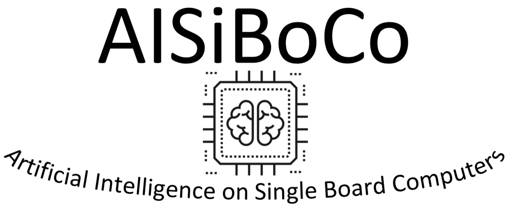

AISIBOCO Knowledge Base 
======================================

Context of this documentation
--------------------------------------
This documentation is written in the context of the project AISIBOCO on the topic of deploying Machine Learning algorithms on single board computers.
It aims to provide an overview of the main contents of the project in the form of a knowledge base. In the project the main differences, advantages and disadvantages of edge computing and cloud computing were 
discussed in the context of a healthcare scenario and a smart city scenario. In this knowledge base, the main metrics that play an important role in the decision process of a solution in the cloud or on the edge are summarized and explained. 
Furthermore the main ecosystems for Machine Learning using cloud services and single board computers are also detailed in this documentation.

.. toctree::
    :maxdepth: 2
    :caption: Contents:
    
    intro
    costdiff
    cloudproviders
    edgehardware
    projectrepos
    references

