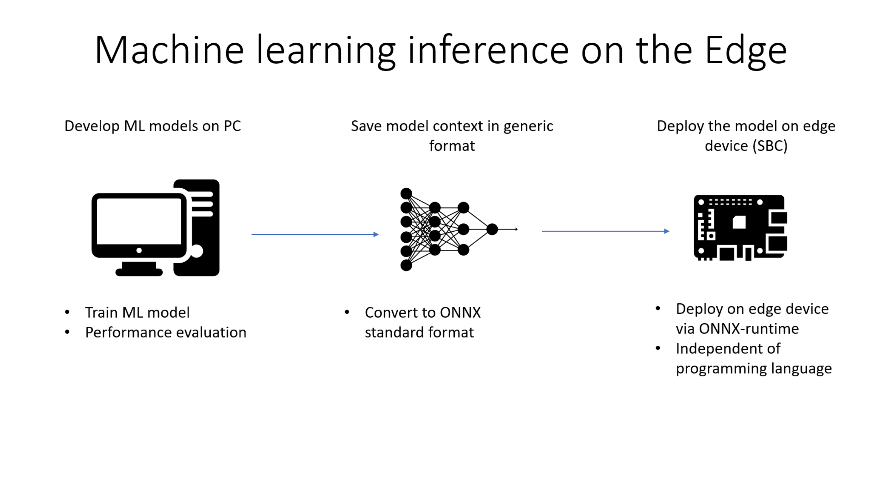

Software Repositories and Project Demos 
==========================================

Summary
--------
This page contains the software repositories that were generated during the project execution and were demonstrated at the various seminars.
The repositories provide example implementations of various Machine Learning topics tailored for use on single board computers and constrained hardware.

Seminar 1: Outlier detection on KDD Cup dataset
------------------------------------------------
The first seminar details an implementation of real time outlier detection on a Raspberry Pi 4 single board computer. The demo is based on the `kddcup99 <http://kdd.ics.uci.edu/databases/kddcup99/kddcup99.html>`_ dataset which contains 
metrics of TCP/IP network connections and the aim is to detect malicious connections and hacking attempts. To achieve this an Isolation Forest model from the `Scikit learn <https://scikit-learn.org/stable/>`_ library is trained and evaluated on this dataset. Furthermore, in the code it is demonstrated how the trained model can be converted to a generic format (`ONNX <https://onnx.ai/>`_) which is independent of Machine learning framework and useable in multiple programming languages.    
The ONNX representation eliminates dependencies and allows to run inference on all sorts of hardware more easily. The repository containg this demo can be found `here  <https://github.com/WillemRaes/AISIBOCOseminar2020>`_ .

Seminar 2: Image and video processing for object detection and classification 
---------------------------------------------------------------------------------

Seminar 3: Image segmentation and model optimization 
---------------------------------------------------------------------------------

